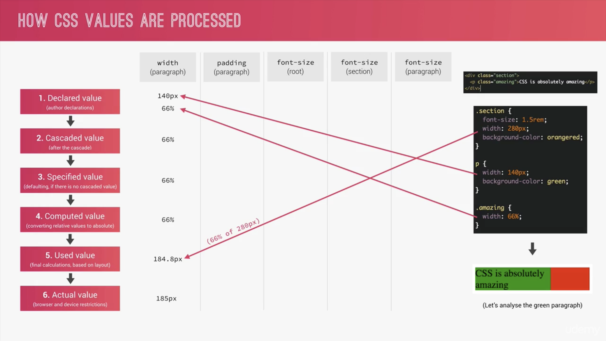

<h3 style="text-align:center;font-weight: 300;" align="center">
  
</h3>

<p align="center">
  
  
  
</p>


> Natours: Let's make some CSS, I mean... Legit looking CSS 🔥


## Progress

#### Day 2

##### Specificity

🍉 `specificity` in action:

```css
#nav div.pull-right a.button {
    background-color: orangered;
}

#nav a.button:hover {
    background-color: yellow;
}
```

Ideally, When hovering around this button, background-color should turn into yellow. However since its specificity is lower than before, the color won't change, to fix, we will need a selector with even higher specificity:

```css
#nav div.pull-right a.button {
    background-color: orangered;
}

#nav div.pull-right a.button:hover {
    background-color: yellow;
}
```
🍈 `background-color: purple !important;` : !important property gives priority to cascade specificity. Use carefully due to its conflicting nature against scalability.

---

##### Value Processing

🍇 Overview slide



🍊 Each property has an initial value, used if nothing is declared

🍋 Browsers specify a `root font-size` for each page (usually 16px)

🍌 Percentages are measured relative to their **parent’s** `font-size`

🍍 `em` are measured relative to their **parent** `font-size`, if used to specify font-size;

🍍 `em` are measured relative to the **current** `font-size`, if used to specify lengths;

🍎 `rem` are always measured relative to the document’s **root** `font-size`;

🍏 `vh` and `vw` are simply percentage measurements of the viewport’s height and width.


🍐 🍑 🍒 🍓 🥝 🍅


## License

🌱 MIT 🌱

---

>  [yuzhoujr.com](http://www.yuzhoujr.com) &nbsp;&middot;&nbsp;
>   [@yuzhoujr](https://github.com/yuzhoujr) &nbsp;&middot;&nbsp;
>   [@yuzhoujr](https://linkedin.com/in/yuzhoujr)
