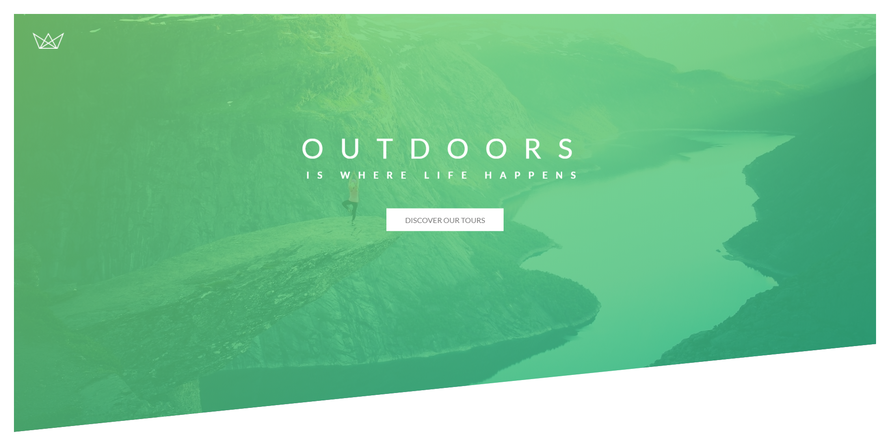

<h3 style="text-align:center;font-weight: 300;" align="center">
  
</h3>

<p align="center">
  
  
  
</p>


> Natours: Let's make some CSS, I mean... Legit looking CSS 🔥


## Progress

#### Day 2

🍈 `clip-path: polygon(0 0, 100% 0, 100% 75vh, 0 100%)`: clips away corner by input exact coordinate of x and y planet.

```css
.header {
    /* 95% of the viewport height 也就是页面高度的95% */
    height: 95vh;
    /* 颜色转变gradient, 0.8是Transparency */
    background-image: linear-gradient(
        to right bottom,
        rgba(126, 213, 111 ,0.8),
        rgba(40, 180, 131 ,0.8)),
        url(../img/hero.jpg);
    /* Fit element in the box */
    background-size: cover;
    background-position: top;
    position: relative;
    /* 让页面切掉右下角， polygon定义四周的点 Clockwise */
    clip-path: polygon(0 0, 100% 0, 100% 75vh, 0 100%)
}
```


Daily End Product:



## License

🌱 MIT 🌱

---

>  [yuzhoujr.com](http://www.yuzhoujr.com) &nbsp;&middot;&nbsp;
>   [@yuzhoujr](https://github.com/yuzhoujr) &nbsp;&middot;&nbsp;
>   [@yuzhoujr](https://linkedin.com/in/yuzhoujr)
