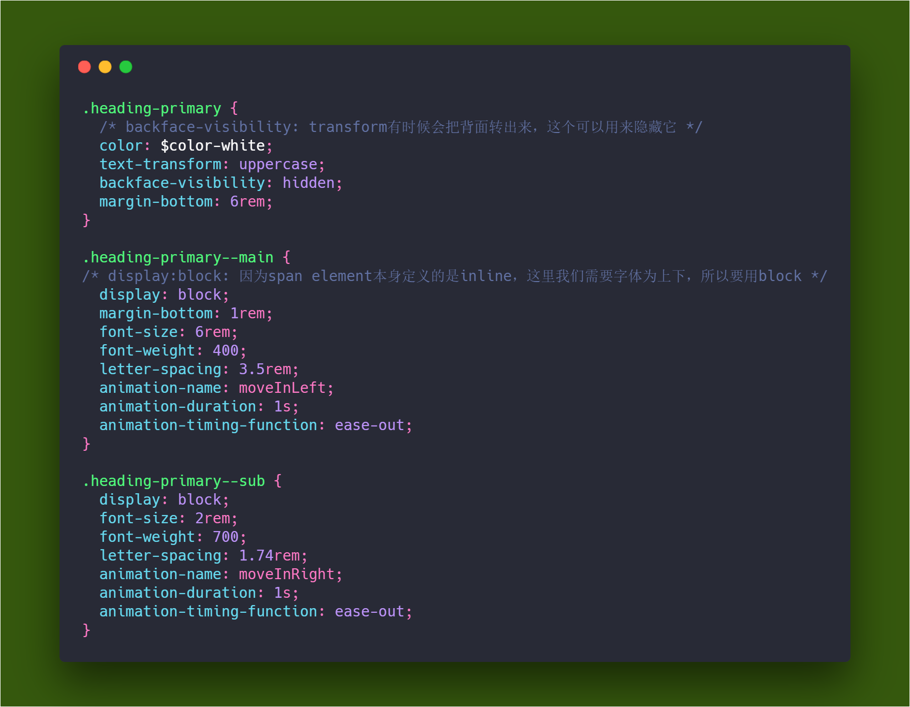
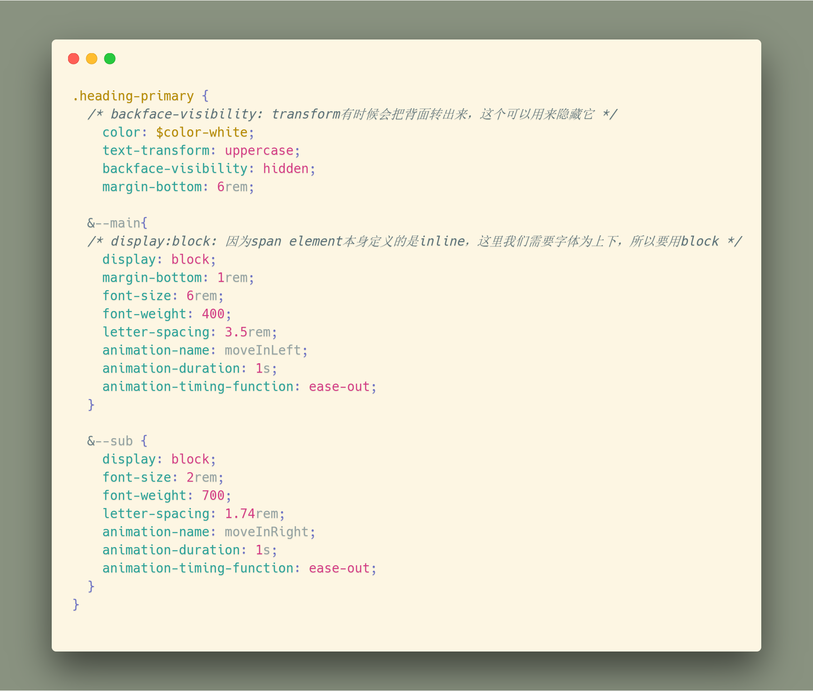

<h3 style="text-align:center;font-weight: 300;" align="center">
  
</h3>

<p align="center">
  
  
  
</p>

> Natours: Let's make some CSS, I mean... Legit looking CSS 🔥

## Progress
#### Day X | Sass Refactoring

<!-- 🍌 🍍 🍎 🍏 🍐 🍑 🍒 🍓 🥝 🍅 🥥 -->

##### Sass Refactoring

`Sass` allows a `parent` selector to include `child` selector if prefix are the same, using the properties along with `BAM` naming convention, the code becomes **art**......

Example:

🍈 `before`



🍊 `after`



---
##### Title 2


🍊 Text

```code

```
---

## License

🌱 MIT 🌱

---
>  [yuzhoujr.com](http://www.yuzhoujr.com) &nbsp;&middot;&nbsp;
>   [@yuzhoujr](https://github.com/yuzhoujr) &nbsp;&middot;&nbsp;
>   [@yuzhoujr](https://linkedin.com/in/yuzhoujr)
