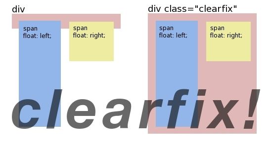
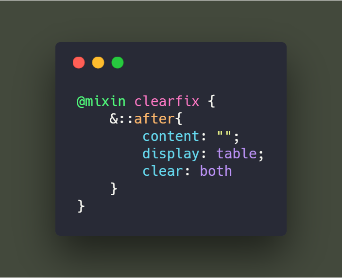

<h3 style="text-align:center;font-weight: 300;" align="center">
  
</h3>

<p align="center">
  
  
  
</p>

> Natours: Let's make some CSS, I mean... Legit looking CSS 🔥

## Progress
#### Day 6 | Grid

<!-- 🍌 🍍 🍎 🍏 🍐 🍑 🍒 🍓 🥝 🍅 🥥 -->

##### Grid

🍈 `clearfix` : The `clearfix` class prevent from bugs related to floating elements. If there are elements with `float` property inside of a `container` (like `div`), the browser will have troubles to calculate the height of that container. This is so-called **zero-height container problem** and it's illustrated in this picture:.



Thus adding the following code to our `div` is necessary to prevent all of the grids floating left to the first line.

`@mixin clearfix`




---
##### Title 2


🍊 Text

```code

```
---

## License

🌱 MIT 🌱

---
>  [yuzhoujr.com](http://www.yuzhoujr.com) &nbsp;&middot;&nbsp;
>   [@yuzhoujr](https://github.com/yuzhoujr) &nbsp;&middot;&nbsp;
>   [@yuzhoujr](https://linkedin.com/in/yuzhoujr)
